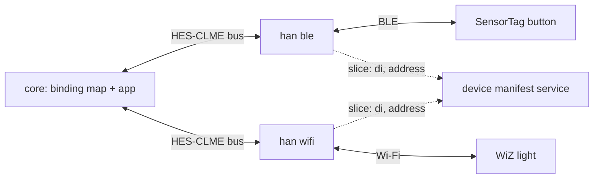

# openhes

An open-source implementation of a **HES (Home Electronic System) gateway**. A
HES gateway lets an application talk to the lights, sensors and switches of a
home or a small building, without caring which protocol each device speaks.

It follows the ISO/IEC HES standards: **ISO/IEC 15045** (HES gateway) and
**ISO/IEC 18012** (product interoperability). It runs on ordinary Linux (amd64)
and on embedded ARM64 boards such as a Raspberry Pi CM4.


## What is a HES gateway?

A home holds many devices that cannot understand each other: Wi-Fi bulbs, BLE
sensors, Zigbee switches, RS-485 meters. The HES gateway is the interoperability
layer between them. Each network gets an **interface module** with an
*interworking function*, which translates that network's messages into one
common form, and translates the common form back. Inside the gateway, every
module then speaks one language, **HES-CLME** (HES *common language message
exchange*), over one event bus.

- **ISO/IEC 15045, "Information technology - Home Electronic System (HES)
  gateway"**, is the gateway series. 15045-1 describes the gateway itself,
  15045-4-1 the structural classes (simple/complex, integral/modular), and
  15045-2 the protocol set that is now called HES-CLME.
- **ISO/IEC 18012, "Guidelines for product interoperability"**, is the
  interoperability series. 18012-1 explains why this standard is needed,
  18012-2 defines the interworking function, **18012-3 defines the lexicon**
  (the standard objects, functions and variables, their symbolic encoding and
  their meaning) together with the event encoding, and 18012-4 defines the
  message formats.

The lexicon is what makes the gateway independent of any protocol: every party
publishes and subscribes to **lexicon paths** such as `/lx/ob/uo/li/ll/da/cv`
(the light's `digitalActuator` object, its `currentValue`), instead of to
vendor-specific attributes. A **binding map**, an XML document that service
modules load at start-up, describes which object drives which other object.
Behaviour that XML cannot express (edge-triggered logic, state, thresholds) goes
into a small application script that runs in an isolated, secured virtual
machine.

### What this repository contains

| Component | What it does |
|---|---|
| **Device Manifest service** - `ohmg dm` | the gateway's own inventory: which devices exist, which module fronts each one, and the real addresses behind them |
| **Core service module** - `ohmg sm core` | the hub: the binding map, the service objects, and the customer-specific app |
| **HAN interface modules** - `ohmg han ble`, `ohmg han wifi` | one per network: translate their devices to HES-CLME (a BLE SensorTag button, a Wi-Fi WiZ bulb) |
| **Unit tests** - `ctest` | the binding map, the XML layer, the services, the manifest handshake |




## Prerequisites

All builds run inside Docker containers, so **you do not need a compiler,
toolchain or library on your machine**. You need three tools:

| Tool | Why | Check it |
|---|---|---|
| **Git** | to clone this repository | `git --version` |
| **Docker** | the builds run in containers (`docker/Dockerfile.amd64`, `docker/Dockerfile.crossbuild`) | `docker run --rm hello-world` |
| **Make** | the `Makefile` starts those containers | `make --version` |

```sh
git clone https://github.com/openhes/openhes.git
cd openhes
```

On Linux, your user must be allowed to talk to the Docker daemon: be in the
`docker` group, or run Docker as root.


## Build

| Command | What you get |
|---|---|
| `make` | **amd64** build, with the unit tests enabled -> `build-amd64/ohmg` |
| `make test` | the same build, then every unit test (ctest) inside the container |
| `make arm64-build` | **ARM64 Release** build for embedded boards -> `build-arm64/ohmg` |

`amd64-build` is the default target, so plain `make` is the native path. Run
`make test` after it: a green test run is the quickest way to check that your
environment works. For a Raspberry Pi or another ARM64 board, `make arm64-build`
produces the Release binary to copy to the board. The cross-toolchain is
`cmake/pi_toolchain_64.cmake`, and your own user writes the build tree (the
`Makefile` passes `--user $(id -u):$(id -g)` to Docker).

Two more targets are useful: `make release` (optimised amd64 build, `-O3` +
`NDEBUG` -> `build-release/ohmg`) and `make clean` (remove every build tree).
`make native-build` compiles on the host instead of in a container; it needs the
full toolchain and the development libraries there, so use it only as a fallback.


## Run

The gateway is a set of cooperating processes - modules - that talk to each other
over UNIX domain sockets in `/tmp`. Start them in this order, one terminal each.
Each one keeps running until you press Ctrl-C.

**Terminal 1 - Device Manifest service** (the device inventory; the interface
modules dial it as they start, so it has to be up first):

```sh
./build-amd64/ohmg -v dm -p tests/data/product.json
```

**Terminal 2 - Core service module** (the hub: binding map + app):

```sh
./build-amd64/ohmg -v sm core \
    --bm-xml tests/data/bm_appservice_button.xml \
    --app src/modules/core/app.lua \
    --identity tests/data/identity.json
```

**Terminal 3 - HAN BLE module** (the button, `di=6`):

```sh
./build-amd64/ohmg -v han ble --module-ref 1 --mac-override 54:6C:0E:B7:20:04
```

**Terminal 4 - HAN Wi-Fi module** (the light, `di=2`; use your bulb's address):

```sh
./build-amd64/ohmg -v han wifi --module-ref 2 --bulb-ip 192.168.1.142
```

`-v` sets a process to `INFO`. That is the level that shows the demo: the row
trace and each PUT in the core, and each command and each poll in the interface
modules. The default level is `WARN` (errors only), so a window without `-v`
looks idle even while the gateway is running. `-vv` adds `DEBUG` (for example
the WiZ round-trip times). Put the flag **before** the subcommand
(`ohmg -v sm core ...`): the global options are read only there, and at most two
`-v` are accepted.

The links between the pieces, in one line each:

- `--bm-xml` is the **routing**: which device's object drives which other
  device's object, plus the addressing table that names the modules.
- `--app` is the **logic** the XML cannot express - here a Lua script that turns
  "button pressed, then released" into a toggle.
- `--identity` is **who the gateway is**, and it is not optional: the
  identification service is mandatory (ISO/IEC 18012-3), so the core module
  refuses to start without a well-formed identity document. `tests/data/identity.json`
  contains demo values - use your own 64 hex characters (`openssl rand -hex 32`)
  for a real gateway, keep the file mode 0600, and never commit or print it.
- `--module-ref` is the module's identity (`moduleRefIndex`) in the manifest.
  It must match the entry in `tests/data/product.json`. The pair
  `(moduleType, moduleRefIndex)` selects each module's device slice.

Press the SensorTag button and release it: the light toggles. Run the core module
with `-v` to see it happen:

```
binding_map[controller]: SUBSCRIBE /lx/ob/uo/ui/ud/da/cv (deviceIndex=6)
binding_map[processor]: op ri=1 (ap) = 1.00                <- release: flip
binding_map[processor]: PUT /lx/ob/uo/li/ll/da/cv = 1 (deviceList=2)
```

Only one PUT is sent per press-and-release cycle: the press does not change the
returned value, so there is nothing new to send. The next release flips it back.
This is the toggle, written as routing (XML) plus state (the app).

Two flags help while experimenting. `--time-zone Europe/Berlin` skips the network
time-zone lookup (useful on a machine with no Internet). `--no-authz` on
`sm core` disables every authorization gate for the run; the demo maps declare no
authorization, so it changes nothing unless you load a map that does.


## Repository layout

```
CMakeLists.txt      the build: sources, options, vendored dependencies
Makefile            the docker-based entry points: make, make test, make arm64-build
cmake/              shared CMake scripts and the cross-compilation toolchain
deps/               vendored third-party libraries
docker/             Dockerfiles for the amd64 and the ARM64 build environments
docs/               the published website (GitHub Pages, openhes.org)
src/
  bm/               the binding map engine: XML -> routing rules
  cli/              the ohmg subcommands (dm, sm core, han ble, han wifi, ...)
  common/           HES data and transport shared by every module (bus, XML, manifest)
  devices/          device drivers
  dm/               the Device Manifest service
  han/              interface modules, one per network
    ble/            the BLE interface module
    wifi/           the Wi-Fi interface module
  modules/          service modules
    core/           the core service module: hub, binding map, service objects, the app
  services/         the service objects that service modules host
    auth/           authorization & authentication service object
    crypto/         cryptographic service object
    id/             identification service object
    time/           time service object
tests/              unit tests and the fixtures they use (binding maps, profile, identity)
```

The files under `tests/` also work as documentation: the XML binding maps are the
clearest description of what the system can route.


## Where to look next

The code has many comments, and the headers are the reference for the design:

| Start here | For |
|---|---|
| `src/bm/bm.h` | the binding map: operation rows, addressing table, value cache |
| `src/common/hes_bus.h` | the HES-CLME event bus every module speaks on |
| `src/services/id/id.h` | the identity document, `pi`/`fp`, and why it is mandatory |
| `src/common/hes_mreg.h` | how a module asks for its device slice and reports presence |
| `src/han/wifi/wifi.c`, `src/han/ble/ble.c` | what an interface module actually does |
| `src/modules/core/app.lua` | the appService contract, in Lua |
| `tests/data/bm_appservice_button.xml` | the smallest useful binding map: button -> app -> light |


## Status

This is a proof of concept, not a product: the identity document and the device
manifest are set up by hand, and the demo fixtures hold demo values. It is
complete enough to run the whole path (a real button on one network driving a
real lamp on another), and to be read as a worked example of the standards.


## Licence

Apache License 2.0 - see [LICENSE](../LICENSE). The vendored libraries under
`deps/` keep their own licences.
